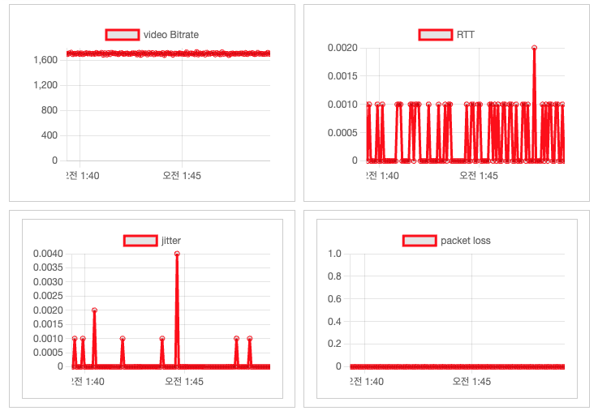

# WebRTC Stats Visualizer

A React application that visualizes WebRTC statistics in real-time using Chart.js and chartjs-plugin-streaming. This project showcases how to collect and display WebRTC metrics such as video bitrate, RTT, jitter, and packet loss in a dynamic and interactive dashboard.

- [Live demo](https://scintillating-brioche-d5e5f9.netlify.app)



## Installation

1. Clone the repository:

   ```bash
   git clone https://github.com/yourusername/webrtc-stats-visualizer.git
   ```

2. Install the dependencies:
   ```bash
   cd webrtc-stats-visualizer
   npm install
   ```

## Usage

1. Start the development server:

   ```bash
   npm start
   ```

2. Open [http://localhost:3000](http://localhost:3000) in your browser.
